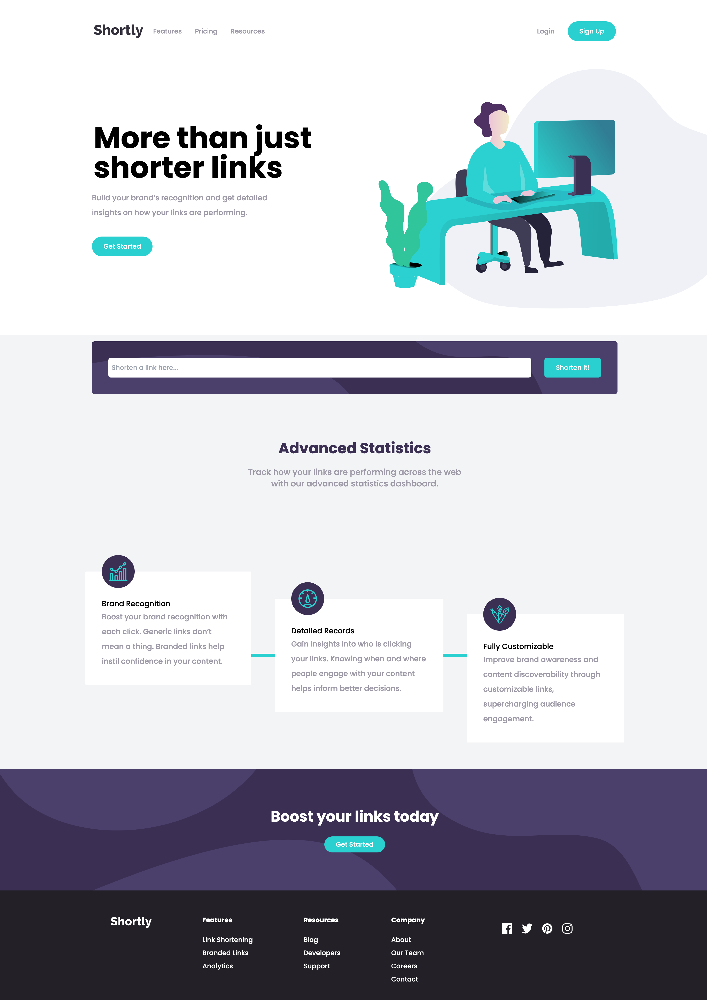

# Frontend Mentor - Shortly URL shortening API Challenge solution

This is a solution to the [Shortly URL shortening API Challenge challenge on Frontend Mentor](https://www.frontendmentor.io/challenges/url-shortening-api-landing-page-2ce3ob-G).

This solution involves building an intuitive and responsive web application that allows users to generate shortened versions of their URLs, store them persistently, and copy them conveniently, providing an enhanced user experience across various devices.

## Table of contents

- [Overview](#overview)
  - [The challenge](#the-challenge)
  - [Screenshot](#screenshot)
  - [Links](#links)
- [My process](#my-process)
  - [Built with](#built-with)
  - [What I learned](#what-i-learned)
  - [Continued development](#continued-development)
  - [Useful resources](#useful-resources)


## Overview

### The challenge

The Shortly URL shortening API challenge calls for the creation of a fully-functional, user-friendly web application. This application should be adaptive to various screen sizes, ensuring an optimal layout for any device. Users must be able to input a valid URL and receive a shortened version of it in return. The primary functionality includes maintaining a persisting list of shortened URLs that the user can conveniently copy to their clipboard with a single click.

Users should be able to:

- View the optimal layout for the site depending on their device's screen size
- Shorten any valid URL
- See a list of their shortened links, even after refreshing the browser
- Copy the shortened link to their clipboard in a single click
- Receive an error message when the `form` is submitted if:
  - The `input` field is empty

### Screenshots

#### Desktop Version

- My Project (displayed on the left)
- Design Reference (displayed on the right)

<p float="left">


</p>


#### Mobile Version

- My Project (displayed on the left)
- Design Reference (displayed on the right)

<p float="left">


</p>


### Links

- Live Site URL: [Live Demo](https://frontend-mentor-shortly-url-shortening.vercel.app)

## My process

### Built with

- Mobile-first workflow
- [React](https://reactjs.org/) - JS library
- [Next.js](https://nextjs.org/) - React framework
- [Tailwindcss](https://tailwindcss.com//) - For styles
- [React query](https://tanstack.com/query/v4/docs/react/overview) - For the API

For this project, React was chosen for its ease in creating interactive UIs, facilitating efficient component-based development for each part of the web app - from the input field to the list of shortened URLs. Next.js, with its automatic server-side rendering, was utilized to ensure a smooth user experience, maintaining a fast and responsive interface even when handling numerous URL shortening requests. TailwindCSS was selected for its utility-first approach, enabling the precise implementation of the design in a quick, mobile-first workflow. This combination of tools, chosen specifically for this project, aids in efficiently developing a performant and user-friendly web application.

### What I learned

This project was an excellent opportunity to integrate several technologies into a single solution. I got a chance to deepen my understanding of React and Next.js while applying a mobile-first development approach. TailwindCSS proved to be a powerful tool for creating responsive designs, and React Query simplified state management and async operations with the API.

Here are a few code snippets from the project:

```js
const handleCopy = (linkToCopy: string) => {
  const modifiedLinks: Url[] = links.map((link) => 
    link.short === linkToCopy ? { ...link, copied: true } : link
  );
  setLinks(modifiedLinks);
  navigator.clipboard.writeText(linkToCopy);
};

```

### Continued development

In the future, I plan to refine this project further. I'll focus on perfecting the UI to match the original design as closely as possible ('pixel perfect'). I'm also considering expanding the functionality, perhaps by adding user accounts and the ability to save shortened URLs permanently.

Additionally, I'm looking to implement the URL shortening feature using my own algorithm instead of relying on an external service. One approach could be to use a base64 encoding scheme to create unique identifiers for each URL. These identifiers would then be stored in a key-value database, like Redis or Google's Firebase, alongside their corresponding URLs. This not only would give me greater control over the shortened URLs, but it would also be an excellent opportunity to gain experience with key-value databases and further explore backend development.

### Useful resources

- [React-query-with-app-router-in-next-js](https://tanstack.com/query/latest/docs/react/guides/ssr#using-the-app-directory-in-nextjs-13) - This resource provided a deep dive into integrating React Query with Next.js. It was particularly useful for handling server-side rendering, a feature built into Next.js.
